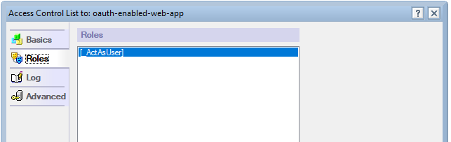
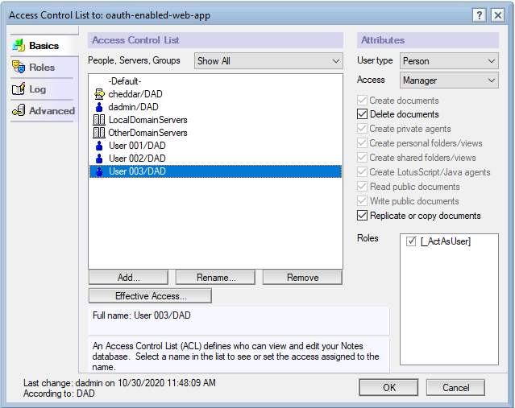
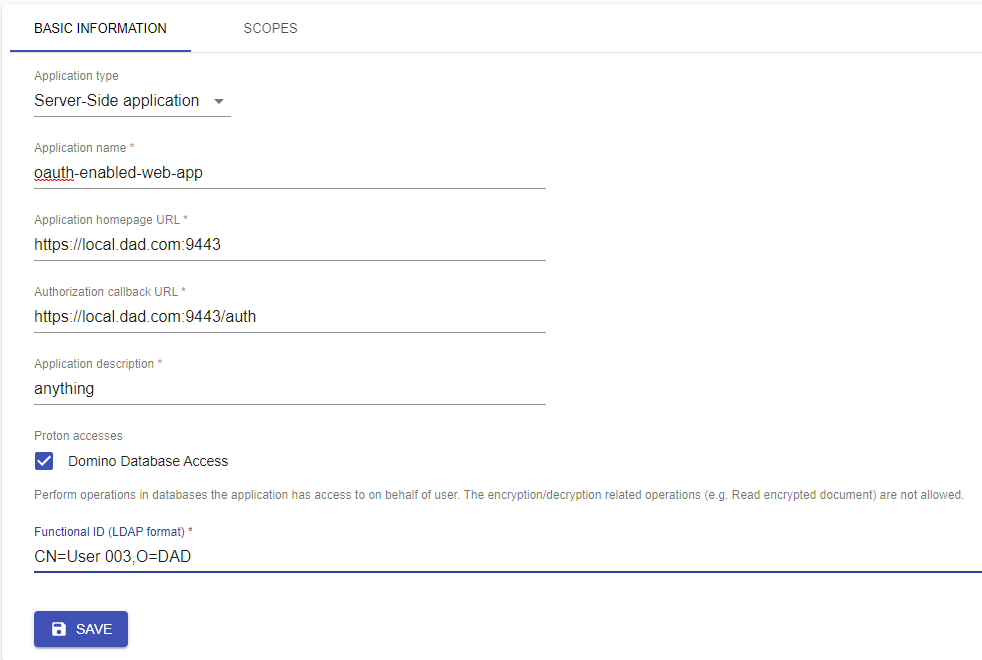

## Running the sample app

### These steps assume that you have performed the following actions already
* Configure your domino server with proton set up with client certificate
  authentication.
* Set up and configure the IAM service.
* Create an ssl server certificate for this sample app to use.
* Create a functional id for this sample application with a client certificate
  ( normal proton functional id process )
* Have at least 2 users registered  in domino to log in to the sample app with.
  * Set internet password for these 2 users.

*My functional id for the purposes of this guide is `User 003/DAD`*

### Set up the sample app

1. Clone this repo
1. In the cloned repo, change to the directory for this sample application
   (`appdev-pack-samples/oauth-enabled-web-app`)
   1. Install your copy of the iam client
      * example: `npm i domino-node-iam-client-1.6.1.tgz`
   1. Install your copy of the domino-db module
      * example: `npm i domino-domino-db-1.7.0.tgz`
   1. Install all other dependencies: `npm ci`
1. Create a blank new database on your domino server configured with proton
   (*example:* `oewa.nsf`)
   1. Create the `_ActAsUser` role in the application
      
   1. Assign your functional id as `Manager` and assign the role you just
      created.
      
   1. Add the 2 other users in ACL as editors (create/delete docs) so they can
      use the app.
1. Create an "Application" in IAM server
   * Fill in the form with values for where your application will be
   * Remember, your node server will need to be running https.
   * You can pick any callback url you like for the `callback url`.
     * typical values are `https://<hostname>/cb` or `https://<hostname>/auth`
     * you will configure this on the node server in the yaml file in the next
       step.
   * example:
     
1. Copy `config.example.yml` to `config.yml` and fill in your details
1. Run the server `npm start`
